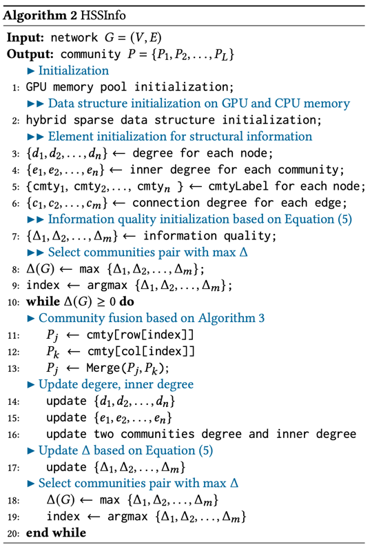

# A Low-Memory Community Detection Algorithm with Hybrid Sparse Structure and Structural Information for Large-scale Networks.

## 1. Introduction

<p align="center">
 
</p>
<p align="center">
The HSSInfo algorithm for community detection. 
</p>

## 2. Configuration and Run

### Datasets
Download the datasets from this link:

* [Google Driver](https://drive.google.com/drive/folders/1oUqT5VWufgIMx2gyPa7DPXpll7B3Ll4a?usp=sharing)

* [Baidu Driver](https://pan.baidu.com/s/1KlR9xtRcM9TJaaD5Lw7UXw?pwd=f282)

### Configuration & Environment

We execute all experiments on the server with Ubuntu 20.04.

1. Install CUDA Toolkit (>= 11.2);
2. Install GCC and G++ (9.4.0) (```sudo apt install gcc g++```)
3. Update the Cmake to a version > 3.21

### Build & Run

1. build 

```bash
mkdir build
cd build
cmake ..
make
```


2. run

```bash
./HSSInfo -i facebook_combined.once.txt -o facebook.txt -n 4039
```

## 


## Citation
If you found use this library useful, please consider citing
```bibtex
@ARTICLE{10129834,
  author={Zhu, Weiguo and Sun, Yongqi and Fang, Rongqiang and Xu, Baomin},
  journal={IEEE Transactions on Parallel and Distributed Systems}, 
  title={A Low-Memory Community Detection Algorithm With Hybrid Sparse Structure and Structural Information for Large-Scale Networks}, 
  year={2023},
  volume={34},
  number={10},
  pages={2671-2683},
  doi={10.1109/TPDS.2023.3277885}
}
```


